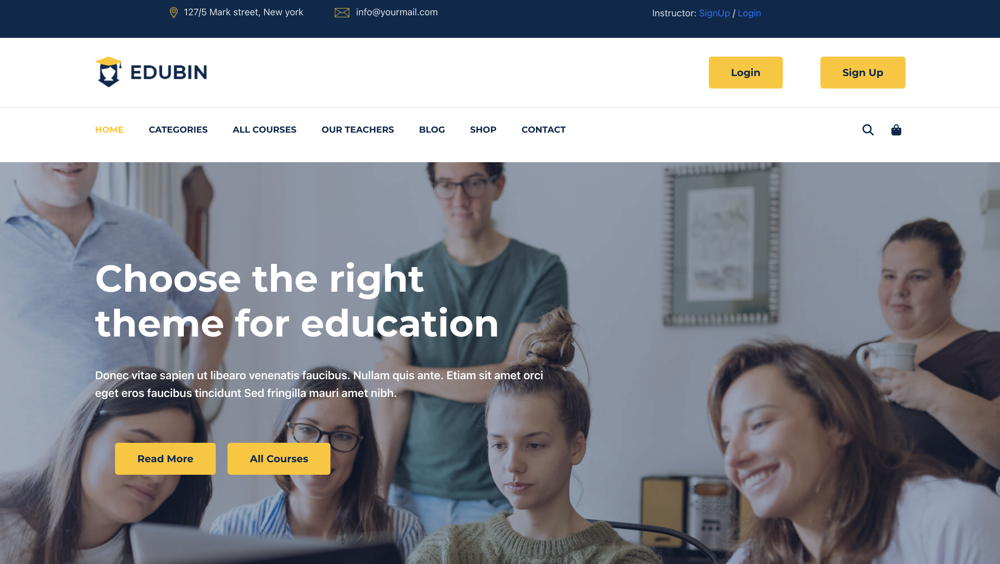

# Online Learning Management System
> Our Online Learning Management System (LMS) is a robust platform for educators and students to streamline online learning. With intuitive course management, real-time progress tracking, and interactive communication tools, it enhances the digital education experience. Explore our repository to revolutionize your online teaching and learning processes!

## Requirements  (Prerequisites)
Tools and packages required to successfully install this project.

* Virtual Environment
* Python 3.10 and up [Install](https://www.python.org/downloads/)
* Django 4.1 and up [Install](https://docs.djangoproject.com/en/4.2/topics/install/#install-the-django-code)
* Database:PostgreSQL

## Installation
A step by step list of commands / guide that informs how to install an instance of this project. 

For Linux and OS X

Create a virtual environment
`python -m venv venv`

Activate the virtual environment
`source venv/bin/activate`

`pip install django`
`pip install psycopg2`

For Windows

Create a virtual environment
`python -m venv venv`

Activate the virtual environment
`venv\Scripts\activate`

`pip install django`
`pip install psycopg2`
 
